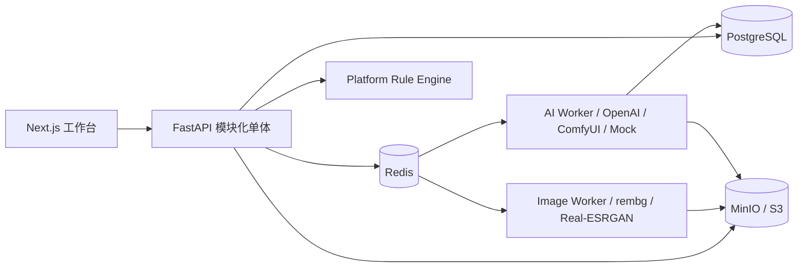

# Architecture

## 1. 形态

V1 采用 monorepo 与模块化单体 API。FastAPI 负责同步业务接口，Redis 承载任务队列/短期缓存，独立 Worker 消费任务，PostgreSQL 保存业务真相，MinIO/S3 保存图片和导出包。AI Worker 在 V1 为模拟实现。

## 2. 边界

- `catalog`：Product、SKU 和属性。
- `assets`：Asset 逻辑身份、不可变 AssetVersion、对象存储。
- `rules`：版本化平台规则与确定性解析。
- `plans`：商品视觉方案、图片数量与确定性 Asset Slot。
- `jobs`：统一图片任务、Workflow Registry、状态机、Provider 路由和 Worker 契约。
- `reviews`：人工决策及重生成意图。
- `exports`：已通过版本筛选、命名与 ZIP manifest。
- `templates`：Template/TemplateVersion、Schema 校验、真实数据绑定、确定性渲染与来源追踪。

## 3. 扩展策略

平台差异通过规范化的 Platform → Market → Category → Rule → RuleVersion 层级和 `platforms/<platform>` 数据表达。视觉方案固定 RuleVersion 后展开槽位，规则后续变更不会改变已创建方案。Phase 2 仍使用模拟 Provider，不接入 AI。

## 4. 一致性与可靠性

- 数据库事务先写任务；提交后投递队列。生产化阶段使用 outbox 消除双写窗口。
- Worker 按 job UUID 幂等；重复执行不得重复推进终态。
- 对象键使用版本 UUID，禁止覆盖写。
- 导出由确定的审核通过版本集合生成，并记录校验和。
- 去背景、增强和生成都只追加 AssetVersion；转换任务允许没有平台规则，生成任务仍必须固定 RuleVersion。
- ComfyUI 作为独立 HTTP 服务运行；主应用只加载已注册的 API workflow 文件，不嵌入 ComfyUI 运行时。
- 模板任务复用 GenerationJob，但以 `provider_type=TEMPLATE` 区分；服务端解释 Konva Schema，并始终追加 REVIEW AssetVersion。

## 5. 安全基线

对象桶默认私有；下载使用短期签名 URL。上传校验 MIME、扩展名和尺寸上限。密钥只来自环境变量。V1 预留 workspace_id，正式多租户前补充行级授权。
