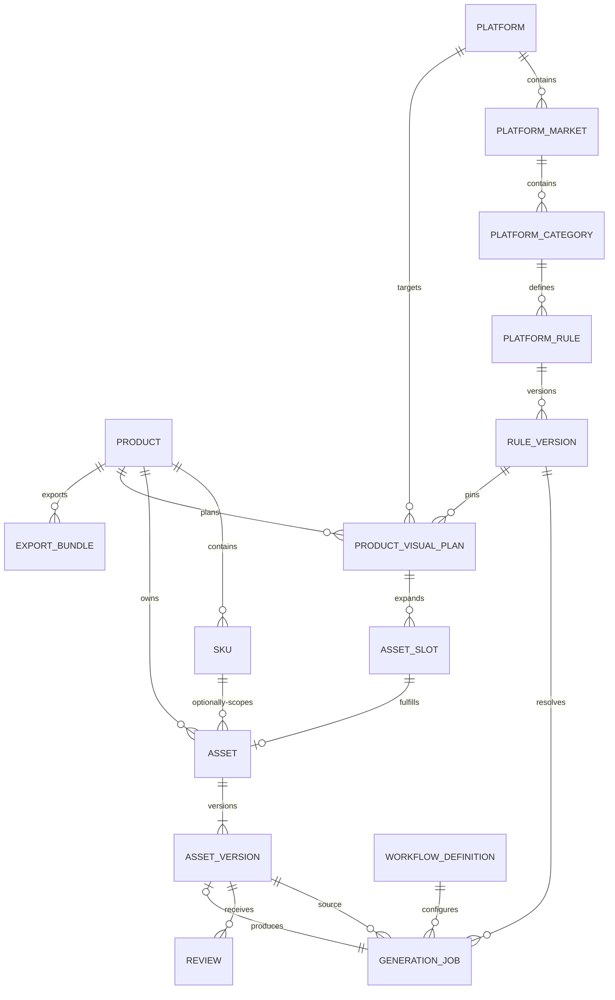

# Data Model

## 核心关系

## 表设计

### products

`id UUID PK`、`name`、`category`、`material`、`color`、`dimensions JSONB`、`weight_value NUMERIC`、`weight_unit`、`selling_points JSONB`、审计时间。

### skus

`id UUID PK`、`product_id FK`、`code UNIQUE`、`attributes JSONB`、审计时间。

### assets / asset_versions

Asset 表示图片用途和版本链根；AssetVersion 表示不可变文件。版本包含 object_key、mime_type、byte_size、width、height、checksum_sha256、source_version_id 与 created_at。`ORIGINAL` 资产的首版本由上传创建，应用层不提供更新与删除能力。

### platforms / platform_markets / platform_categories

平台、市场和类目采用独立实体与稳定 UUID。`code` 是规则解析键；`*` 表示市场或类目通配层级。

### platform_rules / rule_versions

PlatformRule 唯一键为 `(category_id, image_slot, image_type)`。RuleVersion 追加保存 `version`、`effective_date`、最小尺寸、比例、最大字节数、文字/水印策略与扩展约束。解析结果永远返回具体 RuleVersion。

### product_visual_plans / asset_slots

视觉方案固定 Product、Platform 与 RuleVersion，并以 `requested_outputs JSONB` 保存 MAIN、DETAIL、DIMENSION、SCENE、USAGE、PACKAGE、CLOSEUP 数量。AssetSlot 是确定性展开的位置，支持 `MAIN_01` 与 `DIMENSION_FRONT` 等语义编码；一个 Asset 最多履行一个槽位。

### generation_jobs

保存 task_type、source_version_id、引用版本、目标槽位、可选 WorkflowDefinition、平台上下文、resolved_rule_id、Provider、请求 ID、Prompt、seed、重试/超时、output_metadata、output_version_id 与失败分类。生成任务必须固定 RuleVersion；去背景和增强任务不伪造平台规则。合法状态流：pending → processing → completed/failed。

### workflow_definitions

以 `(name, version)` 唯一保存 task_type、provider、workflow_file、default_parameters 和 active。ComfyUI workflow 文件在 Git 中版本化，数据库记录选择的版本；历史任务不会因后续注册表变化而失去追溯信息。

### reviews

追加式决策记录：approved、rejected、regenerate；包含 reviewer、comment、created_at。当前审核状态取最新一条。

### export_bundles

记录平台上下文、object_key、manifest、checksum、status 与创建时间。manifest 固化实际文件名和版本 ID。

### templates / template_versions

Template 保存稳定 code、类型、状态和预览资产。TemplateVersion 以 `(template_id, version)` 唯一，固定画布、背景与 JSON Schema；历史版本无更新 API。

### template_render_records

固定 Template、TemplateVersion、GenerationJob、输出 AssetVersion、Product/SKU、全部来源 AssetVersion、商品数据快照与渲染时间。AssetSlot 可选绑定 Template，但每次实际渲染仍固定具体 TemplateVersion。

## 索引

- Product：category；SKU：product_id、code。
- Asset：product_id、sku_id、asset_type；AssetVersion：asset_id + version_number。
- PlatformRule：解析复合键 + effective_date DESC。
- GenerationJob：status、task_type、workflow_definition_id + created_at；Review：asset_version_id + created_at DESC。
