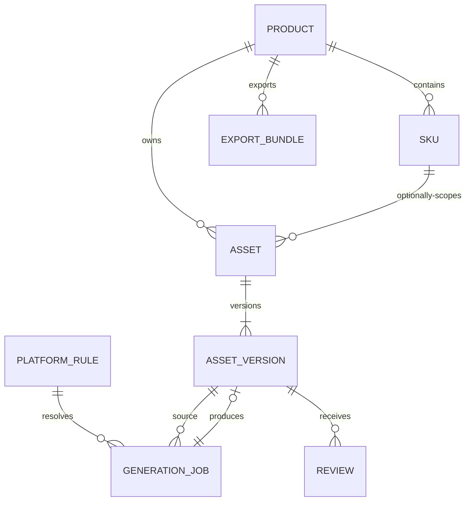

# Data Model

## 核心关系

## 表设计

### products

`id UUID PK`、`name`、`category`、`material`、`color`、`dimensions JSONB`、`weight_value NUMERIC`、`weight_unit`、`selling_points JSONB`、审计时间。

### skus

`id UUID PK`、`product_id FK`、`code UNIQUE`、`attributes JSONB`、审计时间。

### assets / asset_versions

Asset 表示图片用途和版本链根；AssetVersion 表示不可变文件。版本包含 object_key、mime_type、byte_size、width、height、checksum_sha256、source_version_id 与 created_at。`ORIGINAL` 资产的首版本由上传创建，应用层不提供更新与删除能力。

### platform_rules

唯一键为 `(platform, market, category, image_slot, rule_version)`。`effective_date` 决定生效顺序，`constraints JSONB` 承载尺寸、比例、格式、背景和数量约束，`enabled` 控制可解析性。

### generation_jobs

保存 source_version_id、目标槽位、平台上下文、resolved_rule_id、status、parameters、output_version_id、error_message 与时间戳。合法状态流：pending → processing → completed/failed。

### reviews

追加式决策记录：approved、rejected、regenerate；包含 reviewer、comment、created_at。当前审核状态取最新一条。

### export_bundles

记录平台上下文、object_key、manifest、checksum、status 与创建时间。manifest 固化实际文件名和版本 ID。

## 索引

- Product：category；SKU：product_id、code。
- Asset：product_id、sku_id、asset_type；AssetVersion：asset_id + version_number。
- PlatformRule：解析复合键 + effective_date DESC。
- GenerationJob：status + created_at；Review：asset_version_id + created_at DESC。

